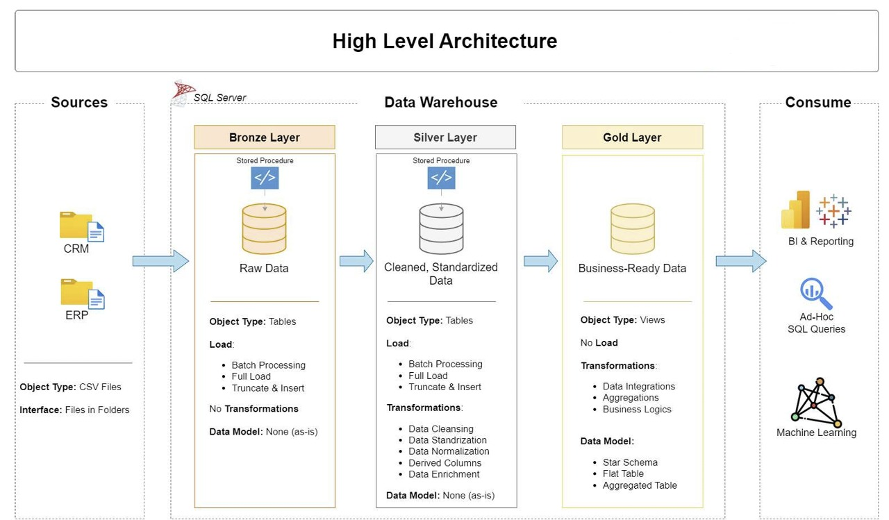

# 🏗️ Data Warehouse & Analytics Project

Welcome to the Data Warehouse and Analytics Project repository! 🚀
This project demonstrates a comprehensive data warehousing and analytics solution, from building a data warehouse to generating actionable insights. Designed as a portfolio project, it highlights industry best practices in data engineering and analytics.

---

## 🧱 Project Architecture

This project is designed using the Medallion Architecture, which separates the pipeline into Bronze, Silver, and Gold layers:



- **Bronze Layer:** Stores raw data as-is from the source systems. Data is ingested from CSV Files into SQL Server Database.
- **Silver Layer:** This layer includes data cleansing, standardization, and normalization processes to prepare data for analysis.
- **Gold Layer:** Business-ready star schema model optimized for analytics and reporting.

---

## 📖 Project Highlights

- **Data Architecture:** Layered data pipeline using Medallion Architecture.
- **ETL Pipelines:** Created robust ETL processes using T-SQL to move data through each layer.
- **Data Modeling:** Designed star schema with fact and dimension tables for optimized querying.
- **Analytics:** Generated insights on sales trends, customer behavior, and product performance.
- **Diagramming:** Designed architecture and ETL flow diagrams using Draw.io.

---

## 🎯 Skills Demonstrated

- SQL Server Development  
- Data Modeling (Star Schema)  
- ETL and Data Cleaning  
- Data Engineering Concepts  
- Business Intelligence Foundations  
- Technical Documentation  

---

## 🛠️ Tools & Technologies Used

- SQL Server Express  
- SQL Server Management Studio (SSMS)  
- T-SQL  
- Draw.io for data architecture & flow diagrams  
- CSV files (ERP and CRM data sources)  
- Git & GitHub  

---

## 🚀 Project Goals

### Data Engineering

- Consolidate data from ERP and CRM systems into a centralized warehouse.  
- Ensure data quality through cleaning and transformation processes.  
- Build a star schema model for structured reporting.

### Analytics

Use SQL to analyze:

- Customer Behavior  
- Product Performance  
- Sales Trends  

These reports are useful for strategic decision-making by business stakeholders.

---

## 📂 Repository Structure
```
data-warehouse-project/
│
├── datasets/                           # Raw datasets used for the project (ERP and CRM data)
│
├── docs/                              # Project documentation and architecture details
│   ├── etl.drawio                     # Draw.io file shows all different techniques and methods of ETL
│   ├── data_architecture.drawio       # Draw.io file shows the project's architecture
│   ├── data_catalog.md                # Catalog of datasets, including field descriptions and metadata
│   ├── data_flow.drawio               # Draw.io file for the data flow diagram
│   ├── data_models.drawio             # Draw.io file for data models (star schema)
│   ├── naming-conventions.md          # Consistent naming guidelines for tables, columns, and files
│
├── scripts/                           # SQL scripts for ETL and transformations
│   ├── bronze/                        # Scripts for extracting and loading raw data
│   ├── silver/                        # Scripts for cleaning and transforming data
│   ├── gold/                          # Scripts for creating analytical models
│
├── tests/                            # Test scripts and quality files
│
├── README.md                         # Project overview and instructions
├── LICENSE                          # License information for the repository
├── .gitignore                       # Files and directories to be ignored by Git
└── requirements.txt                 # Dependencies and requirements for the project
```
---

## 💡 Future Scope

- Add a dashboarding layer using Power BI or Tableau  
- Automate ETL using Python or SSIS  
- Implement Slowly Changing Dimensions (SCD Type 2)  

---

## 🤝 Let’s Connect

[Connect with me on LinkedIn](https://www.linkedin.com/in/giteshgarg08/)
